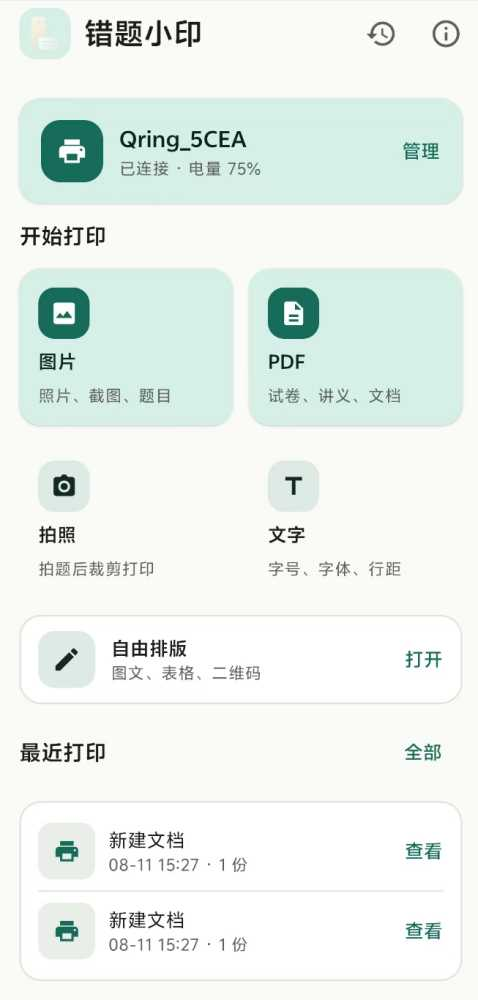
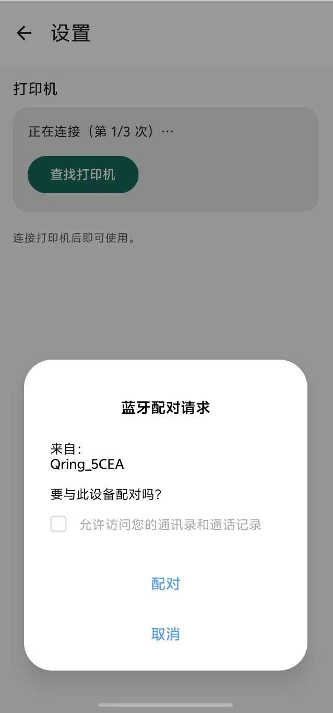
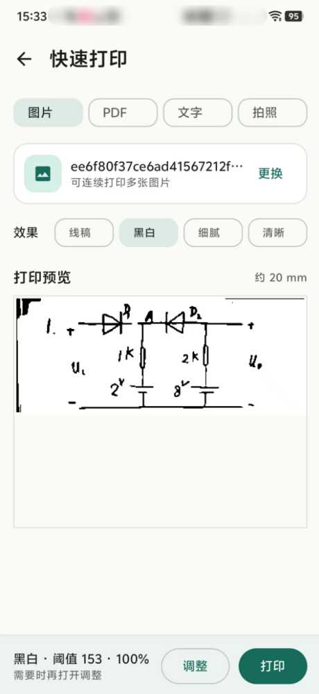
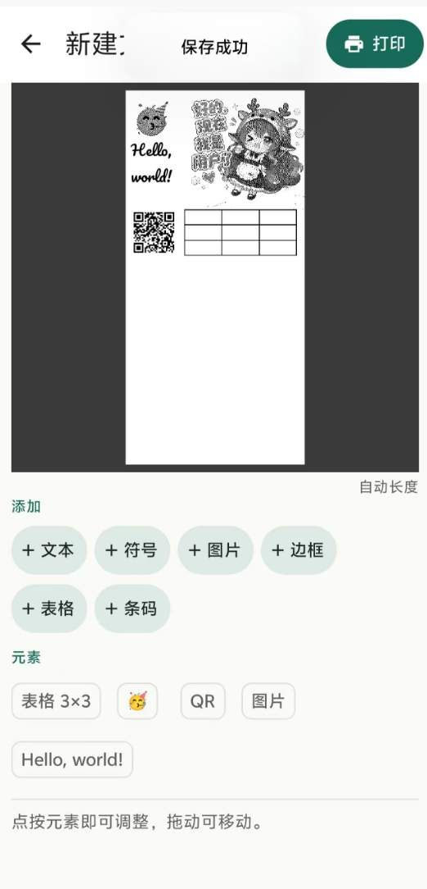
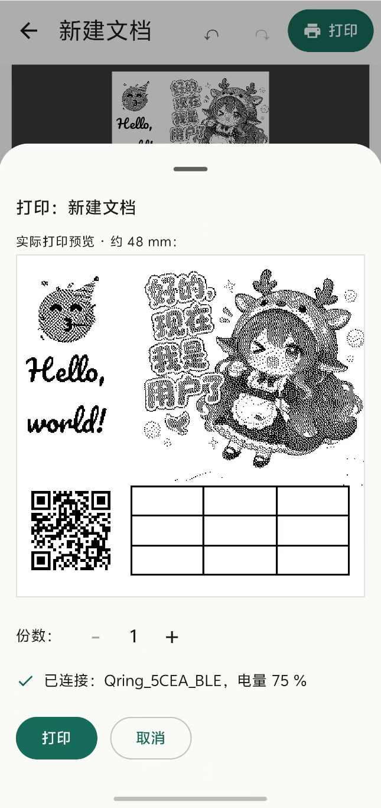
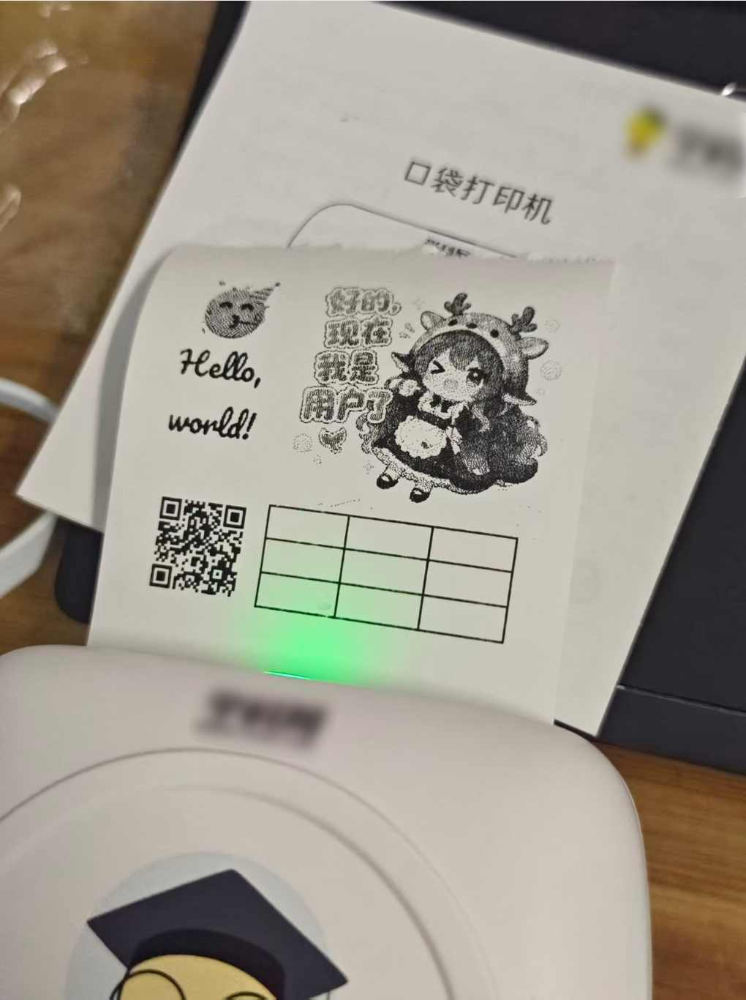

<h1 align="center">口袋小印 安卓端</h1>

<p align="center">
  <a href="LICENSE"></a>
  <a href="https://github.com/soulxyz/xyprt_android"></a>
  <a href="CHANGELOG.md"></a>
</p>

<p align="center">
  面向 学科网 错题小印 X1 便携热敏打印机的 Android 打印应用。
</p>

<p align="center">
  通过蓝牙连接打印机，支持文字、图片、PDF、拍照裁剪、待办清单与自由排版打印，还可以直接接收来自其他应用（微信等）的分享内容进行快速打印。
</p>

<p align="center">
  另外WEB版已上线！支持Windows、安卓端. 在线测试：<a href="https://xyprt.5am.top">[口袋小印WEB版]</a>
</p>

## 功能特性

- **蓝牙打印**：自动兼容 Classic SPP 与 BLE，不需要用户选择通信方式；支持自动重连、状态与电量读取
- **多格式打印**：文字、图片、PDF，支持旋转、缩放、自动长度与 PDF 去白边
- **拍照打印**：拍摄后裁剪所需区域，一键输出；支持去红笔/去蓝笔与退出自动保存
- **待办打印**：快速输入今日事项，打印后直接勾选
- **文档收藏**：PDF 可保存到应用，之后直接再次打开打印
- **自由排版**：文字、图片、表格、二维码、条码、自由涂画、边框与符号，所见即所得
- **多种打印效果**：线稿、黑白、细腻、清晰
- **高效工作流**：最近打印、历史重打、模板收藏、可调打印留白与便携 `.xyprt` 备份
- **系统分享集成**：从微信、相册等应用直接分享或打开内容打印
- **更新提示**：关于页自动检查新版本，支持 GitHub 与镜像下载

## 界面预览

<!-- 截图放入 docs/screenshots/ 目录：home / pair / wechat / quickprint / editor / editor-preview / print.jpg，建议竖屏截图；需要更多页面时复制一格即可 -->

| 主页 | 蓝牙配对 | 微信分享 | 快速打印 |
| :--: | :--: | :--: | :--: |
|  |  |  |  |

| 编辑器 | 编辑效果 | 打印效果 |
| :--: | :--: | :--: |
|  |  |  |

## 构建

你可以通过源代码进行二次构建和开发。

环境要求：

- JDK 17
- Android SDK 36

```bash
./gradlew assembleDebug
```

Gradle 版本由 Wrapper 自动管理，无需手动安装。

## 下载

| 渠道 | 链接 |
| :--: | :-- |
| GitHub Releases（官方） | [下载最新版 APK](https://github.com/soulxyz/xyprt_android/releases/latest/download/xyprt.apk) |
| 中国大陆镜像（ghfast 加速） | [下载最新版 APK](https://ghfast.top/https://github.com/soulxyz/xyprt_android/releases/latest/download/xyprt.apk) |

## 项目数据
<p align="center">
  
  
  
</p>
<p align="center">
  <a href="https://www.star-history.com/?repos=soulxyz%2Fxyprt_android&type=date&legend=top-left">
    <picture>
      <source
        media="(prefers-color-scheme: dark)"
        srcset="https://raw.githubusercontent.com/soulxyz/xyprt_android/star-history/star-history-dark.svg"
      />
      <source
        media="(prefers-color-scheme: light)"
        srcset="https://raw.githubusercontent.com/soulxyz/xyprt_android/star-history/star-history-light.svg"
      />
      
    </picture>
  </a>
</p>


## 文档

- [版本历史](CHANGELOG.md)
- [适配说明](BY288_PORT_NOTES.md)
- [第三方组件声明](THIRD_PARTY_NOTICES.md)

## 上游与致谢

本项目基于开源项目 [LaBLEr](https://github.com/toolicious/labler) 继续开发，深度适配错题小印x1，并添加完善了大量其他功能，优化和修改了UI界面。
感谢上游作者 [toolicious](https://github.com/toolicious) 及所有贡献者。


## 相关项目

[xyPrt_Win（基于Python, Windows端）](https://github.com/Thisko/QrintPrint)

[QrintPrint（基于Arkts, 鸿蒙端）](https://github.com/Thisko/QrintPrint)

[口袋打印（基于Flutter, 安卓端）](https://github.com/tanadiejiang/pocket_print)

## 许可证

本项目继承上游许可，基于 [GPL-3.0-or-later](LICENSE) 发布，即构建产物若进行分发，需要为被分发者提供源代码。
